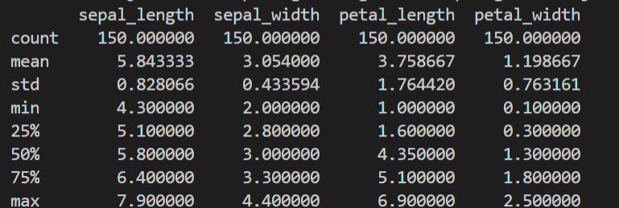
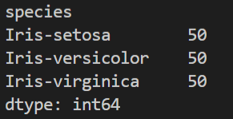
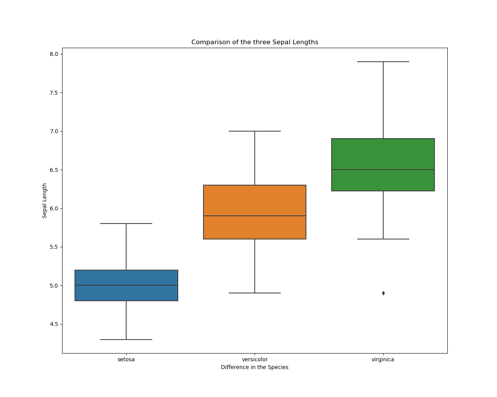
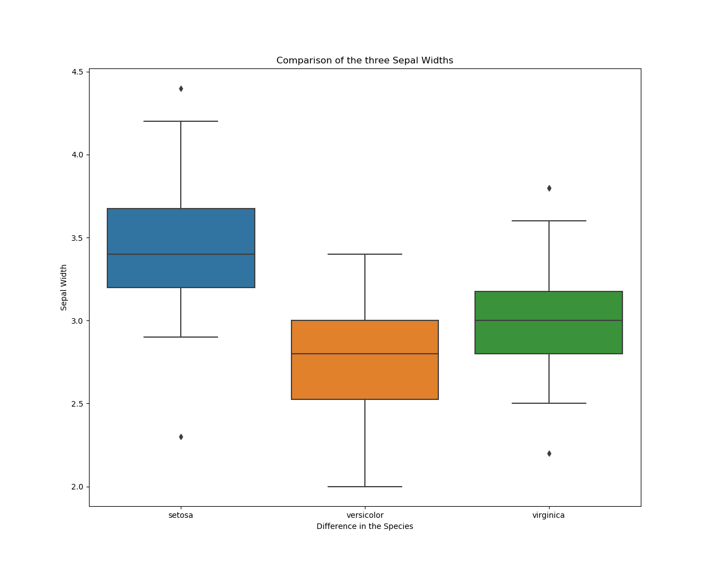
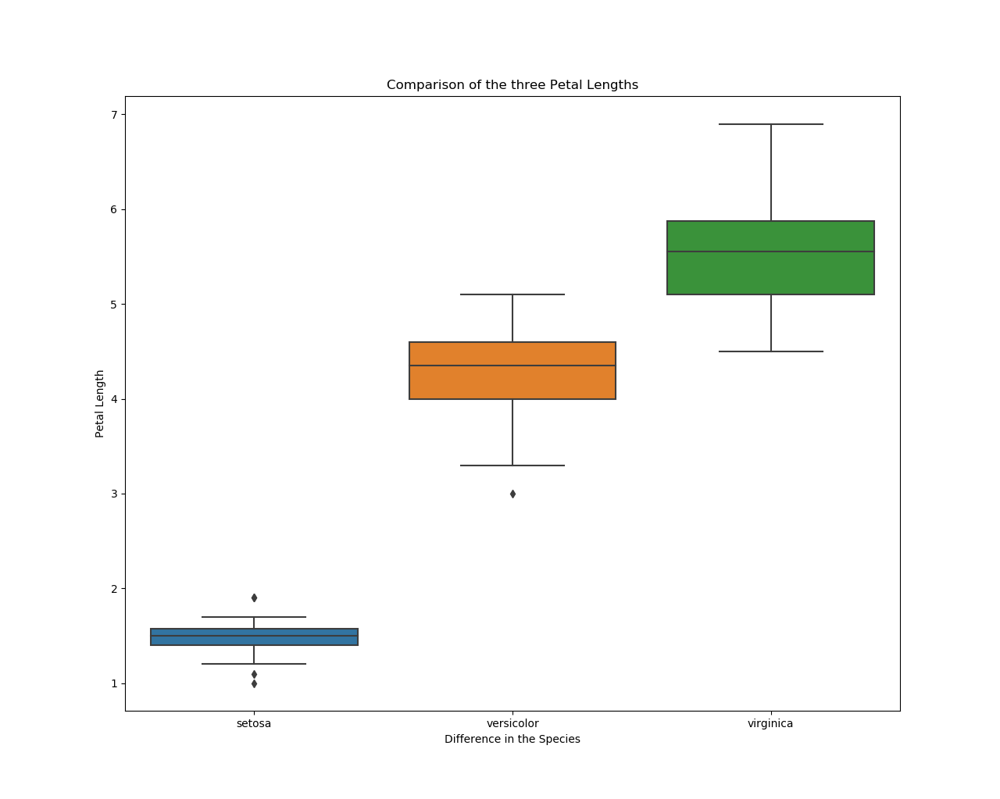
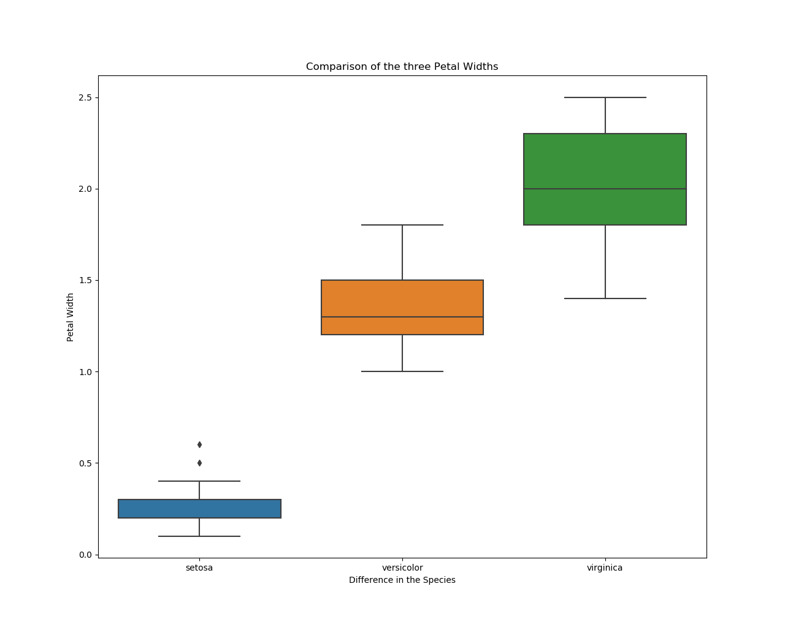
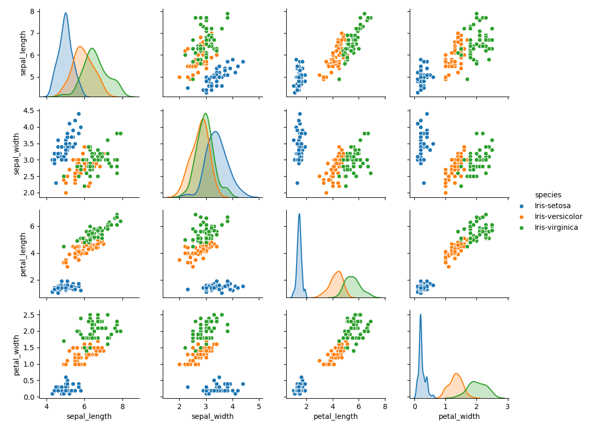

# An Analysis of Fishers Iris Data set

## Ronald Fisher & the Iris Data Set

According to the [Encyclopaedia Brittanica](https://www.britannica.com/biography/Ronald-Aylmer-Fisher "Encyclopaedia Brittanica") Sir Ronald Fisher was a British statistician, commonly known for his development of statistical procedures. Fisher graduated from Cambridge in 1912, being awarded a B.A. in Astronomy, which amongst other aspects, focused on the mathematical components of the discipline.

In 1936 he published, the work that we are analysing in this poject entitled "The use of multiple measurements in taxonomic problems", retrieved from [Wiley Online Library](https://onlinelibrary.wiley.com/doi/abs/10.1111/j.1469-1809.1936.tb02137.x "Wiley Online Library").

 However, it was only upon reading the paper and researching it further that it became clear that the data set is sometimes refered to as the Ansderson data set. According to Fisher himself, [Wiley Online Library](https://onlinelibrary.wiley.com/doi/epdf/10.1111/j.1469-1809.1936.tb02137.x "Wiley Online Library") Dr. Anderson is the man who performed all of the physical recording of the measurements on the Iris species. It was Fisher who performed the analysis on these individual instances.

Before undertaking any detailed primary or secondary analysis,there are some high level observations that can be taken from the material ahead of time. 

According to the [UCI](http://archive.ics.uci.edu/ml/datasets/Iris "UCI") there are a number of aspects to be highlighted by the reserach undertaken by Fisher. This extends to features such as characteristics, instances and attributes. It is in this review that the claim of four attributes is to be found. Upon reading other material and for the purposes of this research, based on observing the date, there are actually five. This is also the case according to the data set review by [MathNerd](https://www.kaggle.com/arshid/iris-flower-dataset#IRIS.csv "MathNerd"). This fifth attribute is the Iris genus, the collection of all Iris sub-species. Below is a table of a very high level view of this information.

|Characteristics| Instances| Attributes|
|---------------|----------|-----------|
| Multivariate  |    150   |     5     | 

According to UCI, the data set itself is a multivariate data set. In this context and with respect to data, multivariate analysis in datasets refers to the number of variables that are under examination. According to [ScienceDirect](https://www.sciencedirect.com/topics/medicine-and-dentistry/multivariate-analysis "ScienceDirect") it is the experimentation of multiple measurements on an experimental unit, for which the relationship between the units are important. This is the scientific component within the name of the paper, where multiple measurements are explicitly referenced.

In terms of the Taxonomy, this is of importance as Fisher was experimenting on data in relation to the Iris. The Iris, as stated previously is the genus, or collective term for similar plants, within this colllective. More specifically the sub sections are the Setosa, Virginica and Versicolor. This will be dealt with in the later stages of this analysis.

The five attributes highlighted on the site Kaggle by [MathNerd](https://www.kaggle.com/arshid/iris-flower-dataset#IRIS.csv "MathNerd"). The first four attributes are the measurements taken from the 150 instances recorded, with the fifth being the type of Iris.

These are listed as: 
 - Sepal Length
 - Sepal Width
 - Petal Length
 - Petal Width
 - Classs (Species)

Sepal, by way of distinction to a petal, is the outermost part of the Iris flower according [Biology Dictionary](https://biologydictionary.net/sepal/ "Biology Dictionary"). These are important attriubtes to focus on, as they allow for a clear pattern for distinguishing between the different types of Iris. The variances of size as detailed by Fisher too, will show a distinguishing trend between the sepal and petal.

Fisher declared that he had taken inspiration from research of the anatomy and physiology within his paper. This included reviews of the developement of the mandible (lower jaw) by Mr. E. Smith as well as the cranial measurements compiled by Mildred Barnard. 

Fisher sought to apply this discipline to taxonomy [Wiley Online Library](https://onlinelibrary.wiley.com/doi/abs/10.1111/j.1469-1809.1936.tb02137.x "Wiley Online Library") by way of measuring the difference in Iris Flowers. Approaching it with his background in mathematics, his work also harnassed the concept of "linear functions of the measurements by which the populations are best discriminate". 

Taxonomy, according to [Merriam-Webster](https://www.merriam-webster.com/dictionary/taxonomy "Merriam-Webster") is the "general principles of scientific classification" as they apply to flowers. We can see that this is the highest point at which the two disciplines are merging, mathematical concepts and the classification of flowers. 

### Praise for the Literature

To fully appreciate the paper, there is a requirement to have an understanding for the reoccuring language within the paper. In this case, I am speaking about 'species' and 'genus'. Genus is the collective term for similar plants, according to the [National Gardening Association](https://garden.org/courseweb/course1/week3/page3.htm "NGA"). According to the National Gardening Association the term species, can only refer to the name of the specific plant within the genus. 

The measurements taken by Anderson and subsequently analysed by Fisher, within this dataset are unambiguous and are distinctive to each species. This transparancy is so crucial as it allows for less and less scrutiny of the data.

From a mathematical perspective, there is a logical sequence of events that Fisher has portrayed in the linear dimensions and how they are structuerd. That there are four different measurements, each with their own place in the formula is a positive movement as it caters for each of the attributes of Speal Length & Width, as well as Petal Length & Width. 

Because of the ananlysis that Fisher performed, according to [Towards Science](https://towardsdatascience.com/the-iris-dataset-a-little-bit-of-history-and-biology-fb4812f5a7b5 "Towards Science"), the discriminant funciton was successful in performing its function. That is, successfully distinguish between the three species.

### Criticism of the literature

As mentioned previously in this analysis, there are two specific species that have been collected, as detailed under the 'Arithmetical Procedure'. Without any mention of the third species, we are now introduced to a variation in the genus, the Iris Viriginica. This was confusing element to stumble across as there is no mention of it until we read the table. According to the 'Arithmetical Procedure' section of the paper, there were only two species taken from the first set of Iris. These were the Iris Setosa and the Iris Versicolor.
The third Iris, is not taken from the same colony, the scope of the research appears to be focused on the first 100 instances before widening the lens to include the versicolor.

Furthermore, there is no mention of why there is a third species as part of this paper until we reach a much later stage of the paper. This is only done once all mathematic foundations are in place. That there is no mention of the Iris Virginica outside of this table, serves the paper poorly in my opinion  as there is no purpose or intended relevance to be garnered. There is also no rationale provided by the author as to its ommission. 

It is at the point, in the 'Applications to the theory of Allopolyploidy' that we discover that the first two species were measured within the same natural colony. We discover that the third was taken from somewhere else by Dr. Anderson. There has been a significant amount of mathematical preparation and calculation completed before this detail is reveale. Fisher does address this issue, eventually, with an acknowledgement of stating that it may 'disturb the mean and their variabilities' [Wiley Online Library](https://onlinelibrary.wiley.com/doi/epdf/10.1111/j.1469-1809.1936.tb02137.x "Wiley Online Library"). 

In relation to the layout of the mathematical components, there are some concerns. These layout paculiarities are quite conflicitng and feel overlooked from the perspective of Fisher. He states "For reasons to be discussed later we shall estimate the variance of a single plant by dividing 1085.5522 by 95", retrieved from [Wiley Online Library](https://onlinelibrary.wiley.com/doi/epdf/10.1111/j.1469-1809.1936.tb02137.x "Wiley Online Library"). This I feel is neither a benefit to the reader, or a point that is guides us to the material for review at a later date. If a reader of this paper does not have a basic understanding of the mathematics, it adds unnecessary confusion where it is not required.

### How has the Iris Data Set been adapted to modern literature

Upon starting this research into the Fisher Iris Data Set, one of the common links to be returned was in the area of Machine Learning. Machine Learning, according to [MIT](https://www.technologyreview.com/2018/11/17/103781/what-is-machine-learning-we-drew-you-another-flowchart/ "MIT") is the process of taking data as well as machine learned algorithms and using the two of them together to find patterns in the data and apply further learning. 

The Iris Data Set, has been used with the Support Vector Machine (SVM) by Ritvik Raj, in order to extract meaning. According to [Ritvik Raj](https://rajritvikblog.wordpress.com/2017/06/29/iris-dataset-analysis-python/ "Ritvik Raj") to test against the algorithm to extract value and makes for a fascinating read in his area of study. Having discovered that the SVM model was the most accurate, Raj ran it against the test data set using the following code: 

        knn = KNeighborsClassifier()
        knn.fit(X_train, Y_train)
        predictions = knn.predict(X_validation)
        print(accuracy_score(Y_validation, predictions))
        print(confusion_matrix(Y_validation, predictions))
        print(classification_report(Y_validation, predictions))

This prodiced an accuracy result of 91%, whilst a confusion matrix using the sklearn library highlights that there are areas that can be worked on to further improve the accuracy.

In the area of machine learning, there is a model known as Gradient Boosting. Gradient boosting is used in the classification of data, according to [Cindy Wang](https://blogs.sas.com/content/sgf/2018/03/29/play-with-classification-of-iris-data-using-gradient-boosting/ "Cindy Wang"). According to Wang, this provides an introductory overview of visual data mining as well as a machine learning product being utiliised, whilst leveraging Fisher's data set to show its capability.

The data set has also successfully been used in the area of neural networking. Neural Networking as defined by [Pathmind](https://pathmind.com/wiki/neural-network#define "Pathmind") is an algorithm that is mapped however loosely on the brain. The purpose of neural networking to develop and recognize patterns. It is also used to cluster and aid with the classification, per the same source. We can see that the Fisher Data Set has been used in this area based on the work of [David Joy](https://www.kaggle.com/azzion/iris-data-set-classification-using-neural-network/execution "David Joy") and the scripts that he has posted to [Kaggle](https://www.kaggle.com/ "Kaggle"). 
Below we can see part of the code extracted from the script:

        tf.reset_default_graph()
        (n_x, m) = X_train_flatten.shape       # shape of X                    
        n_y = Y_train_flatten.shape[0]         # shape of Y
        X, Y = create_placeholders(n_x,n_y)    # creating placeholder 
        tf.set_random_seed(42)

This code is being used to display the value for the five attributes in the dataset. Where we see the "X_train_flatten.shape", this represents the Sepal Length & Width, as well as the Petal Length & Width. In relation to the "Y_train_flatten.shape", this is the representation of the Species.

## Analysis of the data from Python

As we can see from the information extracted from the data set, there are four variables that are to be analysed, namely "Sepal Length", "Sepal Width", "Petal Length", "Petal Width". We can see that there is a considerable difference in the mean between the Sepal Length and the Petal Length. This logically stands to reason, as previously mentioned, the Sepal is the outer cover of the plant, so it would cover more surface area. 

One of the most important aspects of the data, as called out in the analysis is that it is comprised of the Iris Genus. This is the collective term used when there are similar flowers in a set. The image above is an extraction of the individual species. 

As we can see in the image above, there is a considerable difference in the distribution in three tyes of species in relation to the sepal length. We can see that the greatest delta is between the Setosa and the Virginica, with a span of Setosa box being more narrow than that of the Virginica. It's an important reminder to be conscience of that the Sepal is the outer leaf on the Iris plant.

It is clear to see that there are a number of differences in relation to Sepal Width, with a role reversal to be seen between the Setosa and the Virginica. Based on the divisional line between the setosa, there is a majority of the instances captured where the width exceeds the average.

In terms of what we can take from the length of the petal the VIrginica is considerably longer relative to both the setosa and the versicolor. 

Finally, we have the comparison between the three different petal widths. The Virgininca again has shown to be the widest, with the setosa being the least wide. 

We can also see in the image below, which was created using the Seaborn library, the relationships that are possible between these attributes. It has marked out in a four by four matrix format all the permutations of the four attributes.

In order to create the above, we have used the following code:

        sns.pairplot(IrisData, hue="species")

## Conclusion

It is probably the most important takeaway from the paper itself, that Fisher highlights the difficulty in seperating out the difference between the Iris Virginica and the Iris Versicolor. The inability to distnguish the two apart can not be based solely, he says, "on these four measurements of a single flower taken on a plant growing wild." [Fisher, 1936](https://onlinelibrary.wiley.com/doi/epdf/10.1111/j.1469-1809.1936.tb02137.x "Fisher") . That fisher himself has recorded this opinion in the paper is signiifcant.

One of the my biggest takeaways from this data set is its ability to stand above scrutiny over such a period of time. THe data set has adapted from a research into distinguishing species in the world of taxonomy, to being an important milestone in data clustering, as well Machine Learning. 

It is a testament to the quality of the research that more than eighty years later, the mathematical principles that Fisher recorded are still in use and being applied to new areas of research. 

## Runbook for Iris Python Code
According to the website [Stepshot](https://stepshot.net/how-to-create-a-runbook/ "Stepshot") there are some key callouts that needs to be adhered to when creating a runbook. Given the scale of our analysis, we may not need to hit on every marker, but nevertheless, we will try to provide as much structure as possible for readability purposes. 

 - Overview of Process
 - Software to be downloaded / required
 - Data Import Source
 - How to run the program from end to end. 

### Software to be downloaded

There is a requirement to download and install the Anaconda package to your computer. Once this installation has been completed, the user can then proceed to using the software. 

### Data Import Source

The soruce of the data set is taken from the following website source, as hosted on Kaggle. 

[MathNerd](https://www.kaggle.com/arshid/iris-flower-dataset#IRIS.csv "MathNerd") has a copy of the file containing the data within this link. This csv file will needto be read into the python programme.

### How to run the programme from end to end

#### Data Analysis on the Dataset

Import the following libraries to your python programme:

        import pandas
        import numpy as np
        import seaborn as sns
        import matplotlib.pyplot as plt

These libraries are required to perform the anlaysis form end to end.

To read the csv file, we apply the following code in place.

        IrisData = pd.read_csv('IRIS.csv')
        print(IrisData)
        AppendToFile(str(IrisData))

This will provide a simple text display to the terminal with each row and column displayed. 

We are required to produce a text fiel for the variables that are produced in our analysis, so we create a function that will append the data to the text file that we are calling 'Output.txt'.

        def AppendToFile(content):
        file = open("Output.txt", "a")
        file.write(content)
        file.close()

The analysis that we are pulling from the data will take two formats. The first will be in the traditional tabular format, the second will be in visual, thanks to the libraries that we have imported.
We are going to take an overview of the data into an array, a snapshot of the head and tail of the data, the tail. We are also going to extract an overview from a number of viewpoints, such as min, max, standard deviation, as well as a view of the data from each Species within the set. 

        print(IrisData.values)
        a = IrisData.head(10)
        b = IrisData.tail(10)
        c = IrisData.describe
        d = (IrisData.groupby('species').size())

All of these lines are indivudally run and are then subsequently appended to our 'Output.txt' file.

#### Visualing the data

We are going to use some of the functionality that is part of the libraries that we have imported from matplotlib as well as the seaborn library. 
As we have seen in our analysis in the previo;us section of the text, there are some requirements for this project. From a visualisation perspective, we need to be able to run a histogram as well as a scatter plot. 

To run a histogram chart, we need to write out the following script:

        #This as a code will print a hist of the sepal length
        plt.figure(figsize = (6, 5)) 
        SepalHist = IrisData["sepal_length"] 
        plt.hist(SepalHist, bins = 20, color = "green") 
        plt.title("Sepal Length in cm") 
        plt.xlabel("Sepal_Length_cm") 
        plt.ylabel("Count")
        plt.savefig("SepalHist.png")

From the script above, we will be able to run a histogram chart for the Sepal Length.  If we replace the "sepal_length" with one of our other attributes, we will be able to chart these up too. Please note that the .png file wil need to be renamed to suit the attribute.

If we are looking to create scatter plot relationships between the attributes, then we need to be able write a script, leveraging the functionality of the libraries once again to produce charts. 

        plt.scatter(IrisData["sepal_length"], IrisData["sepal_width"])
        plt.title("sepal length versus sepal width")
        plt.xlabel("sepal length")
        plt.ylabel("sepal width")
        plt.show()

From the script above, we will need to replace the attributes of sepal width & length with the petal length & petal width equivalents. 

## Bibliography

### **Markdown Research**:

Article Title: Getting Started. An overview of MarkDown, how it works, and what you can do with it. 
Website Title: www.markdown.org
URL          : https://www.markdownguide.org/getting-started/

Article Title: Mastering Markdown
Website Title: www.guides.github.com
URL          : https://guides.github.com/features/mastering-markdown/

Article Title: How to write a readme.md file? 
Website Title: www.medum.com
URL          : https://medium.com/@saumya.ranjan/how-to-write-a-readme-md-file-markdown-file-20cb7cbcd6f

Article Title: Markdown:Syntax 
Website Title: www.daringfireball.com
URL          : https://daringfireball.net/projects/markdown/syntax#overview

Article Title: Basic Syntax
Website Title: https://www.markdownguide.org
URL          : https://www.markdownguide.org/basic-syntax/

### **Fishers DataSet**: 

Article Title: Iris Flower Dataset used for multi-class classification
Website Title: www.Kaggle.com
URL          : https://www.kaggle.com/arshid/iris-flower-dataset#IRIS.csv

Article Title: The use of multiple measurements in Taxonomic Problems 
Website Title: https://onlinelibrary.wiley.com
URL          : https://onlinelibrary.wiley.com/doi/abs/10.1111/j.1469-1809.1936.tb02137.x

Article Title: Taxonomy
Website Title: https://www.merriam-webster.com
URL          : https://www.merriam-webster.com/dictionary/taxonomy

Article Title: Sir Ronald Aylmer Fisher - British Geneticist And Statistician
Website Title: https://www.britannica.com
URL          : https://www.britannica.com/biography/Ronald-Aylmer-Fisher

Article Title: Multivariate Analysis
Website Title: https://www.sciencedirect.com
URL          : https://www.sciencedirect.com/topics/medicine-and-dentistry/multivariate-analysis

Article Title: The Iris Dataset -  A Little Bit of History and Biology
Website Title: https://towardsdatascience.com
URL          : https://towardsdatascience.com/the-iris-dataset-a-little-bit-of-history-and-biology-fb4812f5a7b5

Article Title: Iris Data Set
Website Title: http://archive.ics.uci.edu
URL          : http://archive.ics.uci.edu/ml/datasets/Iris

Article Title: Sepal Definition
Website Title: https://biologydictionary.net
URL          : https://biologydictionary.net/sepal/

Article Title: National Gardening Association
Website Title: https://garden.org
URL          : https://garden.org/courseweb/course1/week3/page3.htm

### Applications to Modern Literature: 

Article Title: Iris Dataset Analysis (Python)
Website Title: https://rajritvikblog.wordpress.com
URL          : https://rajritvikblog.wordpress.com/2017/06/29/iris-dataset-analysis-python/

Article Title: Play with classification of Iris data using gradient boosting
Website Title: https://blogs.sas.com
URL          : https://blogs.sas.com/content/sgf/2018/03/29/play-with-classification-of-iris-data-using-gradient-boosting/

Article Title: Iris Data Set Classification using Neural Network
Website Title: https://www.kaggle.com
URL          : https://www.kaggle.com/azzion/iris-data-set-classification-using-neural-network/execution

Article Title: Kaggle 
Website Title: https://www.kaggle.com/ 
URL          : https://www.kaggle.com/

Article Title: What is Machine Learning?
Website Title: https://www.technologyreview.com
URL          : https://www.technologyreview.com/2018/11/17/103781/what-is-machine-learning-we-drew-you-another-flowchart/

Article Title: A Beginner's Guide to Neural Networks and Deep Learning
Website Title: https://pathmind.com
URL          : https://pathmind.com/wiki/neural-network#define

### **Skills / Knowledge Gap**:

Article Title: Managing your work on GitHub
Website Title: https://help.github.com
URL          : https://help.github.com/en/github/managing-your-work-on-github

Article Title: How to Create a Runbook that Rocks? Automatically is the Best Way
Website Title: https://stepshot.net
URL          : https://stepshot.net/how-to-create-a-runbook/

Article Title: Fishers Iris Data Set Project
Website Title: https://github.com/
URL          : https://github.com/deniscarr/Fishers-Iris-dataset-project/blob/master/README.txt